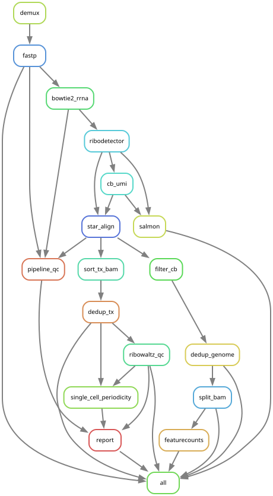

# RiboLens

> **Work in progress** - under active development.

Snakemake pipeline for processing **scribo-seq** (single-cell ribosome profiling) data. Handles the full workflow from BCL demultiplexing through alignment, UMI deduplication, and optional downstream QC, ending in a single self-contained HTML report per sample.

Developed in the [Sendoel Lab](https://www.sendoellab.org/) (University of Zurich).

## Overview

scribo-seq is a plate-based (384-well) single-cell ribosome profiling protocol using 10nt cell barcodes (miRv6) and 10nt UMIs. This pipeline processes single-end sequencing reads through the rules below.

<p align="center">
  
</p>

**Core path (always runs):**

| Rule | Tool | What it does |
|------|------|--------------|
| `demux` *(optional, `run_demux`)* | bcl2fastq | Demultiplex an Illumina run directory into per-sample FASTQs. Implemented as a Snakemake checkpoint so the DAG re-resolves once filenames are known. |
| `fastp` | fastp | Adapter trim, poly-G/X trim, length filter (default 26-34 nt), and extract the 10nt UMI from the 5' end of read 1 into the read name. |
| `bowtie2_rrna` | bowtie2 | First-pass rRNA/tRNA depletion against a bowtie2 index; only unaligned reads are kept. |
| `ribodetector` *(optional, `run_ribodetector`)* | ribodetector | Second-pass ML-based rRNA filter on the bowtie2 output to catch residual rRNA. |
| `cb_umi` | `scripts/cb_umi.py` | Synthesize a "read 2" containing the 10nt cell barcode (positions 1-10) + 10nt UMI (positions 11-20) reconstructed from the read header, so STARsolo can consume the library as if it were paired-end 10x-style. |
| `star_align` | STAR (Solo) | Two-input alignment: cDNA read + synthetic CB/UMI read. Emits a coordinate-sorted genome BAM, a transcriptome BAM (`--quantMode TranscriptomeSAM`), and `Solo.out/` with per-cell Gene + Velocyto counts. Cell barcodes are matched against the miRv6 whitelist. |
| `filter_cb` | sambamba | Drop genome-BAM reads where STAR could not assign a CB (`CB == '-'`). |
| `dedup_genome` | umi_tools | Per-cell UMI deduplication of the filtered genome BAM (`--per-cell`, `--umi-tag=UR`, `--cell-tag=CB`). |
| `sort_tx_bam` | samtools | Coordinate-sort + index the STAR transcriptome BAM (it comes out name-sorted). |
| `dedup_tx` | umi_tools | Per-cell UMI deduplication of the transcriptome BAM. STAR doesn't write `CB` to the transcriptome BAM, so `scripts/transfer_cb_tx.py` first stamps the whitelist-corrected `CB` from the genome BAM onto the transcriptome reads; dedup then groups on `CB` (not the raw `CR`). |

**Optional branches (off by default; enable via config flags):**

| Rule | Flag | What it does |
|------|------|--------------|
| `split_bam` | `run_bam_split` | Split the dedup genome BAM into one BAM per cell barcode (`scripts/split_bam_cb.py`). |
| `featurecounts` | `run_featurecounts` (requires `run_bam_split`) | Run subread `featureCounts` over the per-cell BAMs to produce a CDS-level count matrix (configurable feature type and grouping attribute). |
| `salmon` | `run_salmon` | Alternative quantification via `salmon alevin` (custom barcode/UMI geometry to match scribo-seq). |
| `ribowaltz_qc` | `run_ribowaltz` | CDS-aware footprint QC in R (riboWaltz): length distribution, P-site offsets, 3-nt frame, ends heatmap, metagene plots around start/stop. Runs in the `scribo-ribowaltz` env. |
| `pipeline_qc` | `run_report` | Parses fastp JSON, bowtie2 log, STAR `Log.final.out`, and Solo barcode stats into read-attrition / mapping-breakdown / UMI-knee plots. |
| `single_cell_periodicity` | `run_report` | Per-cell P-site heatmaps around start and stop codons, using the riboWaltz P-site offsets (`periodicity_min_reads` controls the per-cell threshold). |
| `report` | `run_report` | Assembles a single self-contained HTML report per sample with all QC figures base64-embedded; runs in the `scribo-analysis` env. |

## Requirements

Three conda environments are used (specs in `envs/`):

```bash
# Pipeline tools (STAR, bowtie2, samtools, fastp, umi_tools, ribodetector, etc.)
conda env create -f envs/scribo.yaml
# riboWaltz QC (R + riboWaltz) - only needed if run_ribowaltz: true
conda env create -f envs/scribo-ribowaltz.yaml
# Visualisation / HTML report - only needed if run_report: true
conda env create -f envs/scribo-analysis.yaml
```

## Quick Start

### Starting from FASTQ files

```bash
cp configs/config.yaml my_experiment.yaml
# Edit my_experiment.yaml: set fastq_dir, reference paths, etc.
conda activate scribo
snakemake -j 16 --configfile my_experiment.yaml
```

### Starting from BCL files

```bash
cp configs/config.yaml my_experiment.yaml
# Edit my_experiment.yaml:
#   run_demux: true
#   bcl_run_dir: /path/to/illumina/run
#   sample_sheet: /path/to/demux.csv
snakemake -j 16 --configfile my_experiment.yaml
```

### Test run

To sanity-check the full pipeline end-to-end on a small dataset, copy `configs/config.yaml`, point `fastq_dir` at a small FASTQ subsample, and enable the optional steps:

```bash
cp configs/config.yaml configs/config_test.yaml
# edit configs/config_test.yaml:
#   fastq_dir: "testdata"
#   output_dir: "test_results"
#   run_ribowaltz: true
#   run_report: true
conda activate scribo
snakemake -j 8 --configfile configs/config_test.yaml
```

### Useful commands

```bash
snakemake -n --configfile my_experiment.yaml                          # dry run
snakemake -j 16 --configfile my_experiment.yaml --config samples='["sample1"]'  # single sample
snakemake --dag --configfile my_experiment.yaml | dot -Tpng > dag.png # visualize DAG
```

## Configuration

All parameters are in `configs/config.yaml`. Key settings:

| Parameter | Default | Description |
|-----------|---------|-------------|
| `fastq_dir` | - | Directory containing `*.fastq.gz` files |
| `adapter_seq` | `TGGAATTCTCGG` | Adapter sequence for trimming |
| `rrna_index` | - | Bowtie2 index for rRNA/tRNA removal |
| `run_ribodetector` | `true` | Enable second-pass rRNA filtering |
| `star_index` | - | STAR genome index (mouse gencode M25) |
| `run_bam_split` | `false` | Split BAM into per-cell files |
| `run_featurecounts` | `false` | Count CDS features per cell |
| `run_salmon` | `false` | Run salmon alevin quantification |
| `run_ribowaltz` | `false` | Run riboWaltz CDS-level footprint QC |
| `run_report` | `false` | Build per-sample HTML QC report (requires `run_ribowaltz`) |

See `configs/config.yaml` for the full list with comments.

## Output Structure

```
results/{sample}/
├── qc/                fastp QC reports
├── trim/              adapter-trimmed FASTQ
├── rrna/              rRNA-depleted FASTQ
├── ribodetector/      further rRNA-filtered FASTQ
├── cbumi/             synthetic barcode read FASTQ
├── star/              STAR alignment (BAMs, Solo.out/, Log.final.out)
├── genome_bam/        CB-filtered and deduplicated genome BAM
├── tx_bam/            sorted and deduplicated transcriptome BAM
├── ribowaltz/         riboWaltz QC: qc_plots/, periodicity_plots/, CSVs   (optional)
├── qc_report/         read attrition, STAR mapping breakdown, UMI knee    (optional)
├── periodicity/       per-cell P-site heatmaps around start/stop codons   (optional)
└── {sample}.report.html  single-file QC report embedding all of the above (optional)
```

## Sample Sheet Format

For demultiplexing, provide a standard Illumina sample sheet:

```csv
[Data]
Lane,Sample_ID,index,index2
,young1,ATCACG,GAATGGCGTT
,old2,CGATGT,GAATGGCGTT
```

## References

**Method paper:**

- Duré C, Ghoshdastider U, Weber R, Valdivia-Francia F, Renz PF, Khandekar A, Sella F, Hyams K, Taborsky D, Yigit M, Ormiston M, Yamahachi H, Levesque M, Ellis S, Sendoel A. *In vivo single-cell ribosome profiling reveals cell-type-specific translational programs during aging.* bioRxiv, 2024. [doi:10.1101/2024.11.02.621639](https://doi.org/10.1101/2024.11.02.621639)

**Reference data:**

- Genome: Mouse gencode M25 (GRCm38)
- Cell barcodes: miRv6 whitelist (384 barcodes, 10nt)
- Annotation: gencode.vM25.annotation.gtf

**Tools / software:**

- **Snakemake** - Mölder F, *et al.* Sustainable data analysis with Snakemake. *F1000Research* 10:33, 2021. [doi:10.12688/f1000research.29032.2](https://doi.org/10.12688/f1000research.29032.2)
- **fastp** - Chen S, Zhou Y, Chen Y, Gu J. fastp: an ultra-fast all-in-one FASTQ preprocessor. *Bioinformatics* 34(17):i884-i890, 2018. [doi:10.1093/bioinformatics/bty560](https://doi.org/10.1093/bioinformatics/bty560)
- **Bowtie 2** - Langmead B, Salzberg SL. Fast gapped-read alignment with Bowtie 2. *Nat Methods* 9(4):357-359, 2012. [doi:10.1038/nmeth.1923](https://doi.org/10.1038/nmeth.1923)
- **RiboDetector** - Deng ZL, Münch PC, Mreches R, McHardy AC. Rapid and accurate identification of ribosomal RNA sequences via deep learning. *Nucleic Acids Res* 50(10):e60, 2022. [doi:10.1093/nar/gkac112](https://doi.org/10.1093/nar/gkac112)
- **STAR / STARsolo** - Dobin A, *et al.* STAR: ultrafast universal RNA-seq aligner. *Bioinformatics* 29(1):15-21, 2013. [doi:10.1093/bioinformatics/bts635](https://doi.org/10.1093/bioinformatics/bts635); Kaminow B, Yunusov D, Dobin A. STARsolo: accurate, fast and versatile mapping/quantification of single-cell and single-nucleus RNA-seq data. *bioRxiv*, 2021. [doi:10.1101/2021.05.05.442755](https://doi.org/10.1101/2021.05.05.442755)
- **UMI-tools** - Smith T, Heger A, Sudbery I. UMI-tools: modeling sequencing errors in Unique Molecular Identifiers to improve quantification accuracy. *Genome Res* 27(3):491-499, 2017. [doi:10.1101/gr.209601.116](https://doi.org/10.1101/gr.209601.116)
- **SAMtools** - Danecek P, *et al.* Twelve years of SAMtools and BCFtools. *GigaScience* 10(2):giab008, 2021. [doi:10.1093/gigascience/giab008](https://doi.org/10.1093/gigascience/giab008)
- **Sambamba** - Tarasov A, Vilella AJ, Cuppen E, Nijman IJ, Prins P. Sambamba: fast processing of NGS alignment formats. *Bioinformatics* 31(12):2032-2034, 2015. [doi:10.1093/bioinformatics/btv098](https://doi.org/10.1093/bioinformatics/btv098)
- **featureCounts (Subread)** - Liao Y, Smyth GK, Shi W. featureCounts: an efficient general purpose program for assigning sequence reads to genomic features. *Bioinformatics* 30(7):923-930, 2014. [doi:10.1093/bioinformatics/btt656](https://doi.org/10.1093/bioinformatics/btt656)
- **Salmon / Alevin** - Patro R, Duggal G, Love MI, Irizarry RA, Kingsford C. Salmon provides fast and bias-aware quantification of transcript expression. *Nat Methods* 14:417-419, 2017. [doi:10.1038/nmeth.4197](https://doi.org/10.1038/nmeth.4197); Srivastava A, Malik L, Smith T, Sudbery I, Patro R. Alevin efficiently estimates accurate gene abundances from dscRNA-seq data. *Genome Biol* 20:65, 2019. [doi:10.1186/s13059-019-1670-y](https://doi.org/10.1186/s13059-019-1670-y)
- **riboWaltz** - Lauria F, *et al.* riboWaltz: Optimization of ribosome P-site positioning in ribosome profiling data. *PLoS Comput Biol* 14(8):e1006169, 2018. [doi:10.1371/journal.pcbi.1006169](https://doi.org/10.1371/journal.pcbi.1006169)
- **bcl2fastq** - Illumina conversion software ([product page](https://support.illumina.com/sequencing/sequencing_software/bcl2fastq-conversion-software.html))
